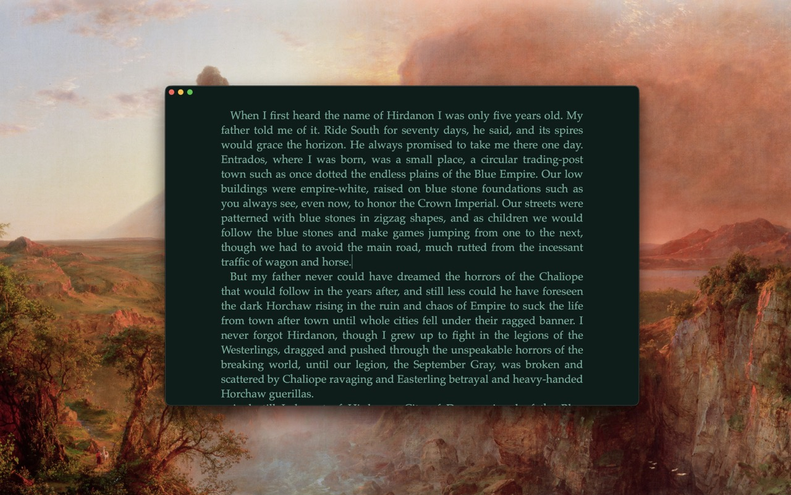

# WhiteThing

  

A minimal (and I mean *minimal*) RTF text editor for macOS-allied fiction writers. Has dark/light modes and auto vanishing controls. Nicer editor than you've probably ever used. 

WhiteThing is ideal for short stories!

## Features

- **Control Bar**: Hover at the top of the window to see the controls. Very self explanatory; can open an existing rtf file or make a new one. Rename or change where it's stored *very* easily.
- **Opinionated Design**: I have locked many things to defaults that I personally believe are best for this. Colors, fonts, etc. You get to adjust some stuff, but not much. Focus on writing!
- **Magic Save**: Never have to hit save. Automatically saves all the time.
- **Persistent Settings**: Font and color are not saved into your RTF file; it's just a visual layer in the WhiteThing editor.
- **Text Formatting**: Support for bold (⌘B) and italic (⌘I) - what else do you need?
- **Easy Export**: WhiteThing is great for writing, but not formatting. Hit the Copy icon in the control bar and paste your whole manuscript into any other app.

## How To Get
Click [here](https://github.com/samuelsullins/whitething/releases/download/v1.0.0/WhiteThing-v1.0.0.zip) to download.

## Why Did I Name It That
Because if you have it in Light mode it is white, and it is also a thing. So it's actually a very descriptive name, which is somewhat rare for me.
